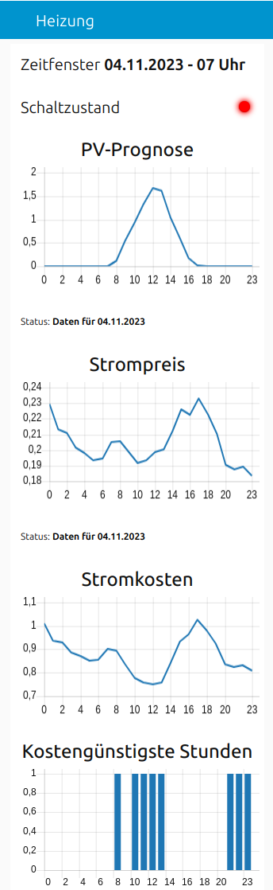

## Dashboard
Die Visualisierung des Flows über das Dashboard zeigt mehrere Diagramme für den Tag:

Ganz oben wird das **Zeitfenster** angezeigt, das für die letzte Prüfung auf die kostengünstigesten Stunden verwendet wurde. Das sollte immer die aktuelle Stunde sein.

Darunter wird der aktuelle **Schaltzustand** angeigt, d.h. wenn das aktuell Zeitfenster als kostengünstig klassifiziert wurde, sollte ein grünes Licht anzeigen, dass der Schalter eingeschaltet ist bzw. ein rotes Licht, dass der Schalter ausgeschaltet ist.

Im Diagramm **PV-Prognose** wird die prognostizierte, stündliche Leistung der PV-Anlage in kW gezeigt. Unterhalb des Diagramms wird angezeigt, für welches Datum die Werte gelten oder eine Fehlermeldung, falls die Werte nicht abgerufen werden konnten.

Das Diagramm **Strompreis** zeigt den stündlichen Preis für eine kWh an. Unterhalb des Diagramms wird angezeigt, für welches Datum die Werte gelten oder eine Fehlermeldung, falls die Werte nicht abgerufen werden konnten.

Unter Berücksichtgung
- der Leistungsaufnahme der Wärmepumpe
- der prognostizierten Leistung der PV-Anlage
- der stündlichen Strompreise
- der Einspeisevergütung

zeigt das Diagramm die stündlichen **Stromkosten** entsprechend der konfigurierten *Leistungsaufnahme der Wärmepumpe* an.

Im Diagramm **Kostengünstigste Stunden** werden entsprechend der *maximalen Anzahl von täglichen Betriebsstunden* diejenigen Stunden angezeigt, die 
- als kostengünstig klassifiziert wurden oder
- Pflichtstunden sind oder
- über die Partyzeit-Funktion hinzugefügt wurden

In diesen Stunden darf die Wärmepumpe einschalten. Im Bild sind zwar die Kosten für die Zeit ab 20 Uhr (83.7 Cent) geringer als um 8 Uhr (89.5 Cent), aber 8 Uhr ist Samstags bei mir als Pflichtstunde konfiguriert.

Im Bereich **Partyzeit** kann eines Stundenbereich zu den bereits als kostengünstig klassifizierten Stunden des aktuellen Tages hinzugefügt werden. Das entspricht der Partyzeit-Funktion bei vielen Heizungssteuerungen.