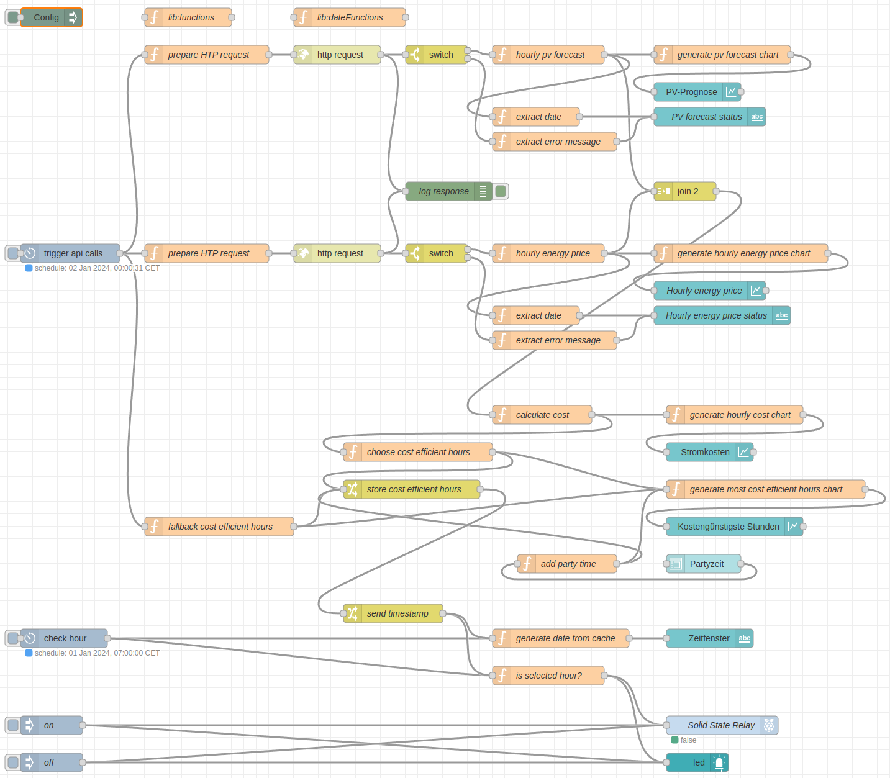
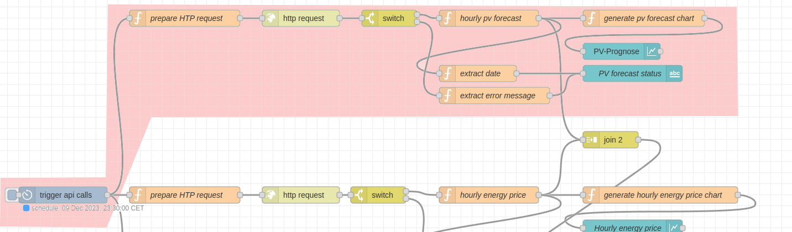
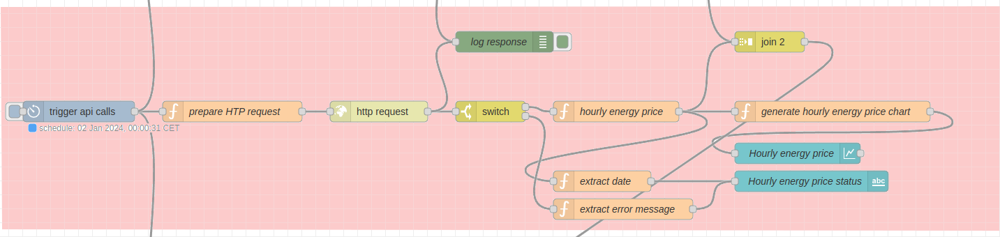
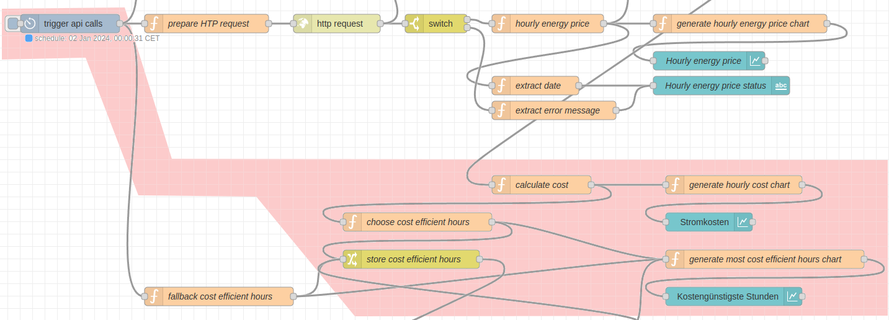
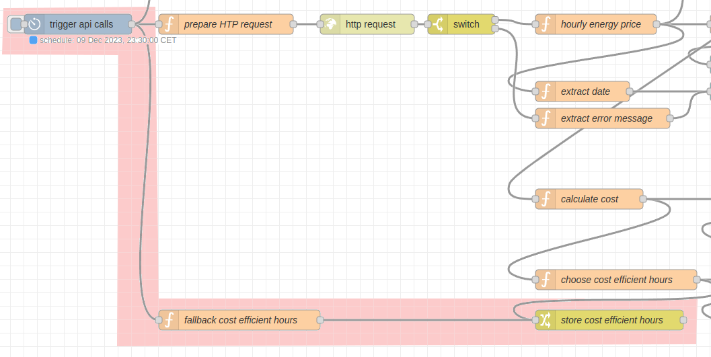
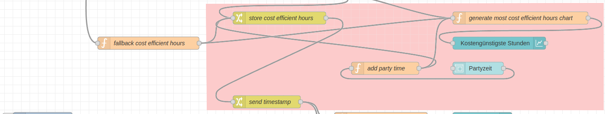
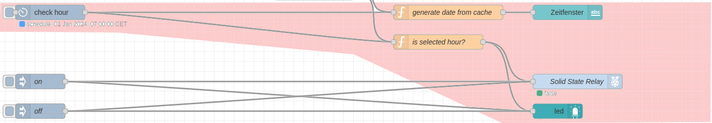

# Flow
Der folgende Abbildung des Flows repräsentiert den Inhalt der Datei [flow.json](flow.json) hier im Repository.

Der Flow besteht im wesentlichen aus sechs Teilen, wobei Teil 1 bis 4 täglich direkt nach Mittnacht (00:00:31 Uhr) ausgeführt werden:

- **Teil 1** sichert die die kostengünstigsten Stunden des vorangegangenen Tages, bevor diese mit den werte des aktuellen Tages überschrieben werden
  
- **Teil 2** beinhaltet die Abfrage der PV-Prognose
  
- **Teil 3** beinhaltet die Abfrage der Strompreise
  
- **Teil 4** berechnet aus diesen Daten die stündlichen Kosten für den Betrieb der Wärmepumpe und bestimmt die kostengünstigsten Stunden
  
- **Teil 5** setzt Standard-Werte für die kostengünstigsten Stunden, für den Fall, dass die Abfrage der PV-Prognose und/oder die Abfrage der Strompreise nicht erfolgreich sind
  
- **Teil 6** erlaubt das Hinzufügen eines Stundenbereichs zu den bereits als kostengünstig klassifizierten Stunden. Das entspricht der Partyzeit-Funktion bei vielen Heizungssteuerungen.
  
- **Teil 7** führt zu jeder vollen Stunde die Prüfung durch, ob die aktuelle Stunde als kostengünstig klassifiziert ist und aktualisiert den Schaltzustand des Solid-State-Relays
  
